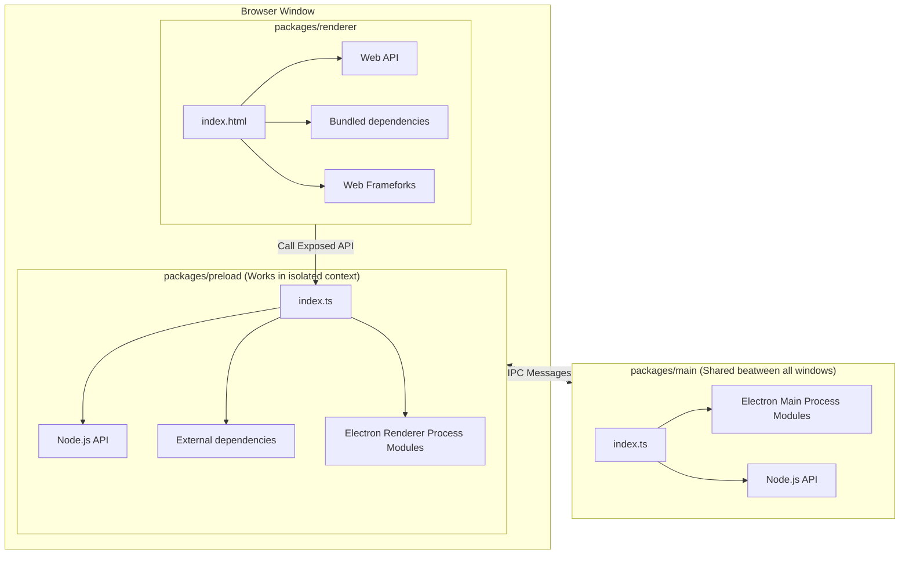
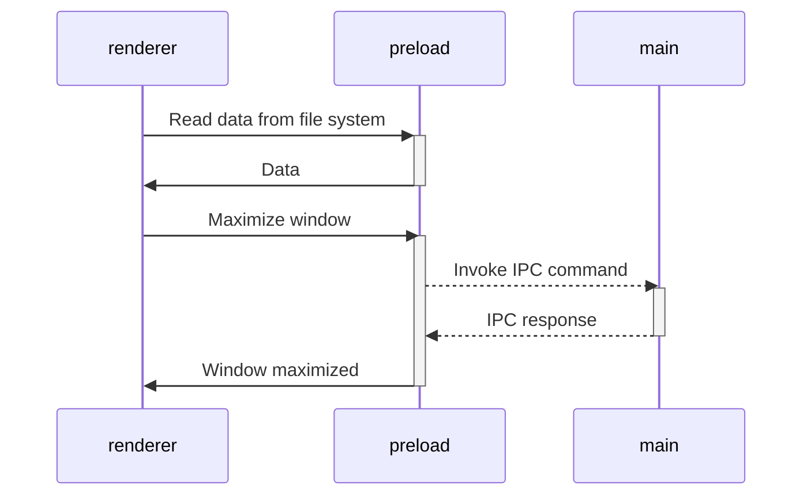

# Synectic Development Environment

  

Synectics is a problem solving methodology that stimulates thought processes of which the subject may be unaware ([Wikipedia](https://en.wikipedia.org/wiki/Synectics)). Synectic IDE is a fundamentally different type of IDE, focused on supporting a human-oriented view of problem solving in software development. Synectic promotes context-specific functionality that compliments and enhances human cognition, memory, and reasoning. As a research prototype, this software has no expressed warranty or guarantees and should be treated as experimental software.

The rationale and principles that guide the design of Synectic can be found in [DESIGN](https://github.com/EPICLab/synectic/blob/master/DESIGN.md). The complete set of programming languages, tools, bundlers, packagers, frameworks, and plugins included in Synectic, along with the configuration requirements, can be found in [ARCHITECTURE](https://github.com/EPICLab/synectic/blob/master/ARCHITECTURE.md). Synectic is released under an MIT license, which can be found in [LICENSE](https://github.com/EPICLab/synectic/blob/master/LICENSE).

Versioning within this project adheres to the rules of [Semantic Versioning 2.0.0](https://semver.org/).

## Usage

### Prerequisites

Synectic requires the host system to have [Git](https://git-scm.com/downloads) installed and available in order to natively execute git commands (version 2.5+ is recommended for [`git worktree`](https://github.blog/2015-07-29-git-2-5-including-multiple-worktrees-and-triangular-workflows/) support).

### Installation

Distributable versions of Synectic are available in various formats for MacOS, Linux, and Windows:

[](https://epiclab.github.io/synectic/download.html) [](https://epiclab.github.io/synectic/download.html) [](https://epiclab.github.io/synectic/download.html)

:warning: **Warning** :warning:: Every operating system uses code signing to establish stable identities for programs that don't change when new versions are released, and to secure the software update process. Windows and macOS additionally use signing as a way to block malware.

This is experimental research software, and is not intended for use in production environments. As such, we are not able to purchase signing keys for Windows and macOS. This means that you will see a warning when installing Synectic on Windows and macOS. You will need to click through the warning to install Synectic. If you are not comfortable with this, please do not install Synectic.

See the [Installation Guide](https://github.com/EPICLab/synectic/wiki/Installation-Guide) for guidance on using unsigned builds of Synectic.

[](https://www.hydraulic.dev/)

## Development

To run Synectic from source, or to contribute to the project, follow the instructions below.

### Recommended Environment

We recommend using [VSCode](https://code.visualstudio.com/) with the following plugins:

- [ESLint](https://marketplace.visualstudio.com/items?itemName=dbaeumer.vscode-eslint)
- [Prettier](https://marketplace.visualstudio.com/items?itemName=esbenp.prettier-vscode)

### Source Installation

To install Synectic from source, use the following steps:

1. Install [Node.js](https://nodejs.org/en/).
2. Install [Yarn](https://yarnpkg.com/lang/en/) Package Manager (`npm`/`npx` can also be used, but `yarn` is preferred).
3. Clone this repository:

   ```bash
   git clone git@github.com:EPICLab/synectic.git
   ```

4. Move into the project root directory:

   ```bash
   cd synectic
   ```

5. Install project dependencies:

   ```bash
   yarn install
   ```

6. Build the `main`/`preload`/`renderer` modules:

   ```bash
   yarn build
   ```

7. Start Synectic in watch mode:

   ```bash
   yarn watch
   ```

### CLI

Make sure to follow the [Source Installation](#source-installation) instructions before using the CLI. The following commands can be used from within the project root directory:

- `yarn watch` - Start Electron app in watch mode.
- `yarn build` - Build app but for local debugging only.
- `yarn lint` - Lint the code using [ESLint](https://eslint.org/).
- `yarn typecheck` - Run a TypeScript check.
- `yarn test` - Run all unit, integration, and e2e tests.
- `yarn format` - Reformat all codebase to project code style.
- `yarn bundle` - The command will execute the same steps as `yarn build`, but afterwards will call the [Conveyor `site`](https://conveyor.hydraulic.dev/11.4/tutorial/tortoise/5-serve-the-site/) task to request a full build of the download/repository site, before [Publishing through GitHub](https://conveyor.hydraulic.dev/11.4/configs/download-pages/#publishing-through-github).

### Project Structure

This project is based on the [Vite Electron Builder Boilerplate](https://github.com/cawa-93/vite-electron-builder) template, which was written following the latest safety requirements, recommendations and best practices. The structure of the project is similar to a [monorepo](https://monorepo.tools/). The entire scource code of the project is divided into three modules (packages) that are each bundled independently:

- **packages/renderer** - Responsible for the contents of the application window. In fact, it is a regular web application. In developer mode, you can even open it in a browser. The development and build process is the same as for classic web applications. Access to low-level API electrons or Node.js is done through the preload layer.
- **packages/preload** - Contain Electron [preload scripts](https://www.electronjs.org/docs/latest/tutorial/tutorial-preload). Acts as an intermediate bridge between the renderer process and the API exposed by electron and Node.js. Runs in an isolated browser context, but has direct access to the full Node.js functionality.
- **packages/main** - Contain Electron [main script](https://www.electronjs.org/docs/tutorial/quick-start#create-the-main-script-file). This is the main process that powers the application. It manages creating and handling the spawned BrowserWindow, setting and enforcing secure permissions and request handlers. You can also configure it to do much more as per your need, such as: logging, reporting statistics and health status among others.

Schematically, the structure of the application and the method of communication between packages can be depicted as follows:



#### Context Isolation

The `main` and `preload` packages are built in [library mode](https://vitejs.dev/guide/build.html#library-mode) after compiling from TypeScript to JavaScript. The `renderer` package builds as a regular web app.

Because the `renderer` works and builds like a _regular web application_, we can only use dependencies that support the browser or compile to a browser-friendly format. This means that we can use React (or any frontend dependencies we want) in the `renderer`, but we _CANNOT_ use any native Node.js APIs, such as, `systeminformation`.

Using any Node.js APIs in the `renderer` layer will cause the application to crash. Instead, any Node.js runtime APIs that are needed in the frontend have been exported from the `preload` package and exposed via the [`electron.contextBridge.exposeInMainWorld`](https://www.electronjs.org/docs/latest/api/context-bridge) method.

The `exposeInMainWorld` method is called automatically by the [`unplugin-auto-expose`](https://github.com/cawa-93/unplugin-auto-expose), so we can import and call these methods within the `renderer` package by using the `#preload` alias.

#### Working with Electron API

Although the preload has access to all of Node.js's API, it _still runs in the BrowserWindow context_, so a limited set of electron modules are available in it. Check the [Electron documentation](https://www.electronjs.org/docs/latest/api/clipboard) for a full list of available methods.

All other electron methods can be invoked in the `main` module.

As a result, the architecture of interaction between all modules is as follows:



> Read more about [Inter-Process Communication](https://www.electronjs.org/docs/latest/tutorial/ipc)

#### Modes and Environment Variables

> :warning: **Warning** :warning:: To prevent accidentally leaking env variables to the client, only variables prefixed with `VITE_` are exposed to any Vite-processed code.

All environment variables are set as part of the `import.meta`, and can be accessed via `import.meta.env`. The mode option is used to specify the value of `import.meta.env.MODE` and the corresponding environment variables files that need to be loaded.

By default, there are two modes:

- `production` is used by default
- `development` is used by `yarn watch` script

When running the build script, the environment variables are loaded from the following files in the project root:

```bash
.env                # loaded in all cases
.env.local          # loaded in all cases, ignored by git
.env.[mode]         # only loaded in specified env mode
.env.[mode].local   # only loaded in specified env mode, ignored by git
```

See more about Vite environment variables here: [`envPrefix`](https://vitejs.dev/config/shared-options.html#envprefix)

### Releases

Installation is required; see [CLI](#cli) for installation instructions. The following commands can be used from within the project root directory:

- `yarn release` - executes [`yarn version`](https://yarnpkg.com/cli/version) plugin to initiate a major semver version bump, generate a new [version.js](https://github.com/EPICLab/synectic/blob/main/version.js) using [`genversion`](https://www.npmjs.com/package/genversion), stage and commit all relevant version files, generate a new [annotated Git tag](https://git-scm.com/book/en/v2/Git-Basics-Tagging), and [atomically](https://git-scm.com/docs/git-push#Documentation/git-push.txt---no-atomic) push changes to the remote repository to trigger [GitHub Actions](https://docs.github.com/en/actions).

### Caveats

The Node.js ecosystem is currently undergoing a transition from CommonJS to ES Modules (ESM) in upstream libraries, and Electron is no exception. `electron@28.0.0` will be the first stable release of Electron to support ESM, and is set to release on 2023-12-05 according to the [Electron Timelines](https://github.com/electron/electron/blob/main/docs/tutorial/electron-timelines.md). Given the dependency on Electron, Synectic will not be able to take advantage of ESM until this time. There is a [ES Modules (ESM) in Electron](https://github.com/electron/electron/blob/main/docs/tutorial/esm.md) tutorial describing the steps required in order to take advantage of ESM once 28.0.0 is generally available.

We can continue to use CJS modules, and ESM modules that provide a CJS fallback, until `electron@28.0.0` is released. But there are a few modules that are ESM-only, and are listed here in the hopes that they can be included in Synectic in a future release:

- [`dot-prop`](https://github.com/sindresorhus/dot-prop)
- [`find-up`](https://github.com/sindresorhus/find-up)

Both of these modules are ESM-only, and provided by the same developer. The developer consistently references a particular GitHub Gist, [_Pure ESM package_](https://gist.github.com/sindresorhus/a39789f98801d908bbc7ff3ecc99d99c), whenever they are asked about CommonJS support.

### Contributors

We welcome contributions to this open source project on Github. When contributing, please follow the [Contributing Code Guide](https://github.com/EPICLab/synectic/blob/master/CONTRIBUTING.md). Also, any new contributors should include a commit that updates this `README.md` document to include your name and a link to your GitHub profile page (unless you wish to be anonymous).

[](https://github.com/EPICLab/synectic/graphs/contributors)[^1] [^1]: Contributor images made with [contrib.rocks](https://contrib.rocks).

- Nicholas Nelson ([@nelsonni](https://github.com/nelsonni))
- Andrea Tongsak ([@andrealit](https://github.com/andrealit))
- Jett Seale ([@jettseale](https://github.com/jettseale))
- Brandon Dring ([@El_Dringo_Brannde](https://github.com/El-Dringo-Brannde))
- Marjan Adeli ([@Marjan-Adeli](https://github.com/Marjan-Adeli))
- Hayden Coffey ([@hcoffey1](https://github.com/hcoffey1))
- Lauren Gastineau ([@laurengastineau](https://github.com/laurengastineau))
- Samarendra Hedaoo ([@knightsamar](https://github.com/knightsamar))
